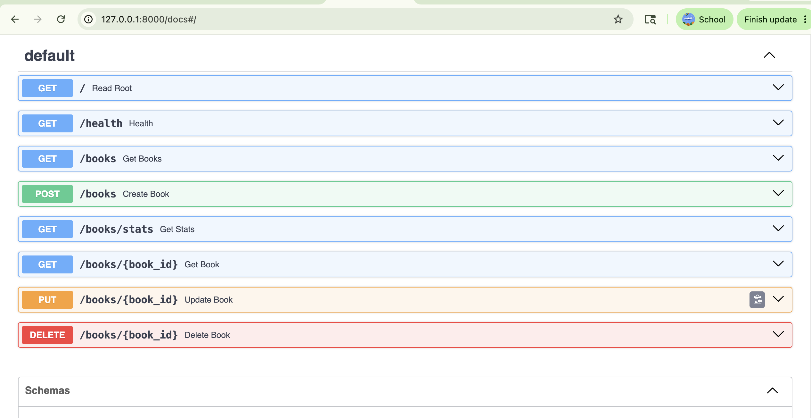
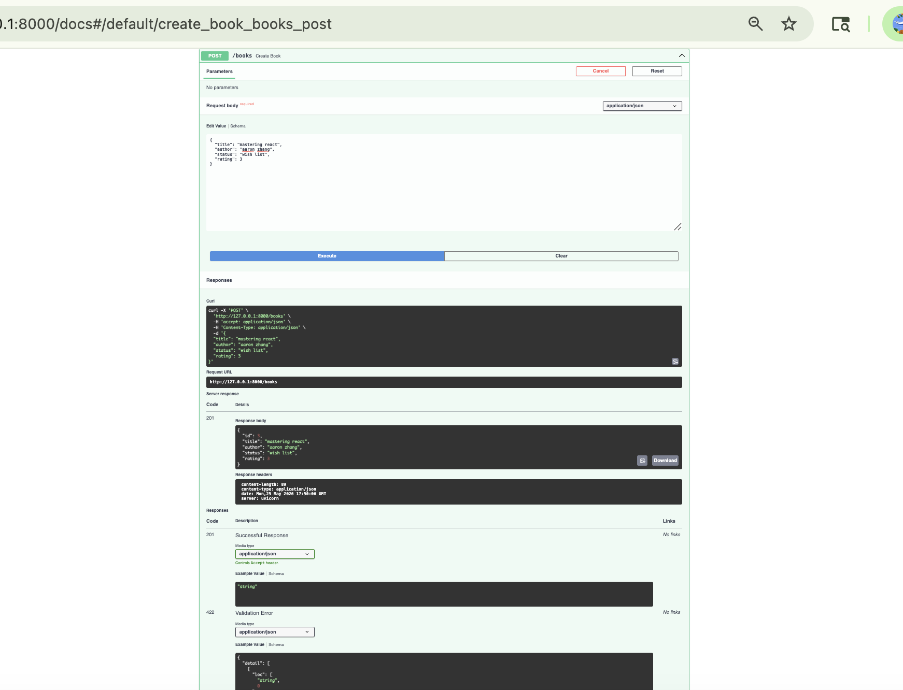

# Week 3 — Book Tracker API (Complete Submission)

**Student:** Mingjing Zhang  
**Course:** Full Stack Engineering — Week 3  
**GitHub repository:** https://github.com/mingjing-zhang/week-03-api

### Screenshots folder (`screenshot/`)

| File | Description |
|------|-------------|
| `01-docs-all-endpoints.png` | Swagger `/docs` — all endpoints visible (**submission**) |
| `02-post-books-201-created.png` | `POST /books` — **201** response with created book (**submission**) |
| `03-post-books-request-body.png` | `POST /books` — request body before execute (extra) |
| `04-get-books-stats-response.png` | `GET /books/stats` — **200** stats JSON (extra) |
| `05-api-root-welcome.png` | `GET /` — welcome JSON (extra) |
| `06-docs-header-only.png` | `/docs` — title only, endpoints cut off (extra) |
| `07-docs-incomplete-old.png` | `/docs` — early version, only `/` and `/health` (extra) |

---

## 1. GitHub repo link

https://github.com/mingjing-zhang/week-03-api

**Commits (6 total, meets ≥ 4 requirement):**

1. Initial FastAPI project setup  
2. Add basic FastAPI app with health endpoint  
3. Add CRUD endpoints for book tracking  
4. add stats endpoint  
5. Complete book tracker API  
6. submit the reflection.md  

---

## 2. Screenshot — `/docs` with all endpoints visible

**File:** `screenshot/01-docs-all-endpoints.png`

All required routes are visible:

| Method | Path | Description |
|--------|------|-------------|
| GET | `/` | Read Root |
| GET | `/health` | Health |
| GET | `/books` | Get Books (optional `?status=` filter) |
| POST | `/books` | Create Book |
| GET | `/books/stats` | Get Stats |
| GET | `/books/{book_id}` | Get Book |
| PUT | `/books/{book_id}` | Update Book |
| DELETE | `/books/{book_id}` | Delete Book |

---

## 3. Screenshot — successful `POST /books` in Swagger

**File:** `screenshot/02-post-books-201-created.png`

- **Request:** `POST http://127.0.0.1:8000/books` with JSON body (`title`, `author`, `status`, `rating`)  
- **Response code:** **201**  
- **Response body:** created book with `"id": 1` and all fields returned  

---

## 4. Week 3 Reflection

### 1. What was the most confusing thing about Python compared to JavaScript?

The biggest adjustment was how Python handles structure and data. In JavaScript I’m used to curly braces for blocks and `array.map()` for transforming lists; in Python, indentation *is* the syntax, and list comprehensions like `[b.upper() for b in books]` felt like a new language at first. I also kept reaching for `python` or global `uvicorn` and hitting the wrong environment—whereas in Node I’m more used to everything living in one `node_modules` folder. Pydantic models were another shift: they feel like TypeScript interfaces, but they actually *run* at request time and reject bad JSON before my route code runs.

### 2. What does an HTTP status code tell you? Give one example.

A status code tells you the **outcome of the request**—whether it succeeded, failed, and roughly why—without reading the whole response body. For example, when I `POST` a new book and it’s created successfully, the API returns **201 Created**. That means “a new resource was made,” which is more specific than **200 OK**. If I request `GET /books/999` and that id doesn’t exist, **404 Not Found** tells the client the resource isn’t there, not that the server crashed.

### 3. What was the difference between a path parameter and a query parameter?

A **path parameter** is part of the URL path and usually identifies *one specific resource*. In my API, `GET /books/3` uses `book_id = 3` in the path to fetch that exact book. A **query parameter** comes after `?` and is optional—used for filtering or options, not identity. For example, `GET /books?status=reading` returns all books where `status` is `"reading"`, but the path is still `/books`. I also learned that `/books/stats` must be defined *before* `/books/{book_id}` so FastAPI doesn’t treat `"stats"` as an id.

### 4. What would happen to all the data if you restarted the server right now? Why is that a problem, and what will we use to fix it?

If I restart Uvicorn right now, **all books disappear**. They only live in the in-memory list `books_db`, which is recreated empty every time the process starts. That’s a problem for a real app: users expect their data to survive deploys, crashes, and restarts. To fix it, we’ll use a **database** (likely SQLite or PostgreSQL) so books are stored on disk or in a persistent service, and the API will read/write through that instead of a Python list in RAM.
